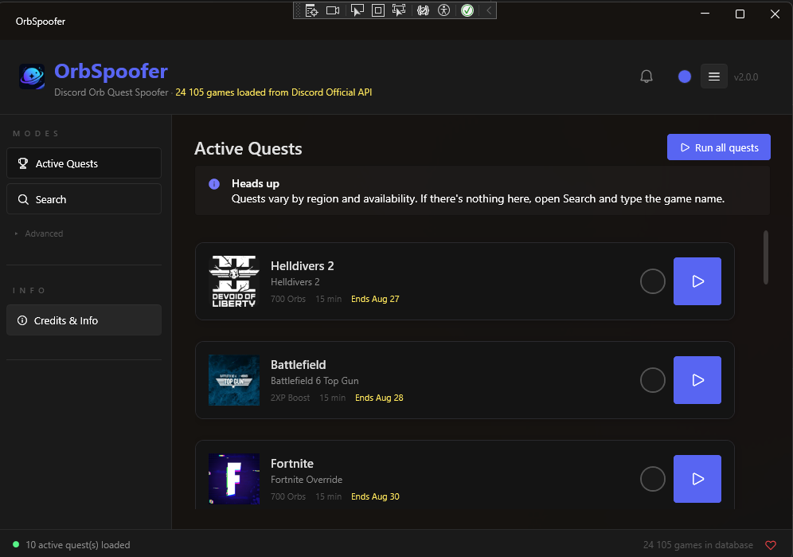
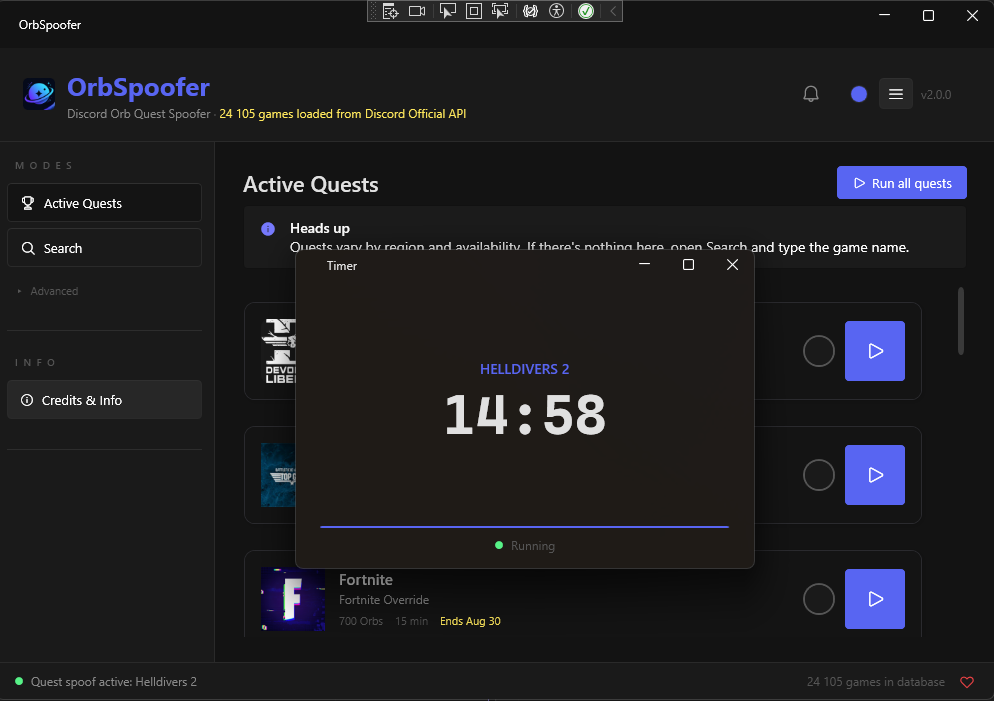

<div align="center">

# ✦ OrbSpoofer

### Discord Orb Quest Spoofer — Built in C# / .NET 10

[](https://dotnet.microsoft.com)
[](https://learn.microsoft.com/en-us/dotnet/desktop/wpf/)
[](https://github.com/ZavalaSebas/OrbSpoofer)
[](./LICENSE)
[](https://github.com/ZavalaSebas/OrbSpoofer/releases)

<br/>

Automate Discord orb quests without downloading games :)

[Get Started](#-get-started) · [How It Works](#how-it-works) · [Usage](#usage) · [Active Quests](#active-quests) · [Features](#features) · [Steam Quest](#steam-quest-mode)

</div>

<br/>

> **✨ New in 2.1.0 — Aurora redesign.** Vivo + suave sin perder seriedad: glows, cards con elevacion, transiciones suaves, sidebar animada y toda la UI pulida. [See changelog](./CHANGELOG.md#210--2026-08-28).

<br/>

## What is OrbSpoofer?

A Windows desktop app built in **C# / .NET 10** that automates Discord orb quests by creating lightweight background processes — no game downloads, no modifications, no manual setup.

It pulls Discord's own detectable games list from their public API, copies a base executable, renames it to the exact process name Discord expects, and launches it in the background. Discord sees the name, checks the box, you get your orbs.

**No code injection. No client modification. No network spoofing.** Just a renamed process sitting in your task list — which is the public mechanism Discord uses to detect what you're playing.

Born from the idea behind [orbshacker](https://github.com/strykey/orbshacker) by [Strykey](https://github.com/strykey), rebuilt from scratch in .NET with a native WPF interface.

> **Discord automation tool, built for educational purposes.** You are solely responsible for complying with Discord's Terms of Service. Use at your own risk.

<br/>

## How It Works

The way Discord detects what you're playing is by reading your Windows process list. Lets say `roblox.exe` running? Must be Roblox!. There's no deeper verification — no hash check, no memory scan, nothing. The name is all it checks. OrbSpoofer automates this process end-to-end.

1. Launch OrbSpoofer
2. **Active Quests** appear automatically — fetched live from Discord's quest API
3. Double-click a quest (or hit the ▶ button) to start spoofing
4. Done — Discord thinks you're playing

No active quests? Switch to **Search** — it checks Discord's database first, then Steam, and shows one result per game. Need a specific source? Open **Advanced**.

The fake process runs until you close it. Discord keeps detecting it the entire time. Since orb quests don't involve kernel-level anti-cheat, there's nothing watching for renamed executables.

<br/>

## ⚡ Get Started

<div align="center">
<table>
<tr>
<td align="center" width="50%">

**📦 Download a Release**

Grab the latest `OrbSpoofer.exe` from  
[Releases](https://github.com/ZavalaSebas/OrbSpoofer/releases)  
Self-contained — no .NET required. Just run it.

</td>
<td align="center" width="50%">

**🔧 Build from Source**

```bash
git clone https://github.com/ZavalaSebas/OrbSpoofer.git
cd OrbSpoofer
dotnet publish -c Release -r win-x64 \
  --self-contained true \
  -p:PublishSingleFile=true
```

</td>
</tr>
</table>
</div>

<br/>

## Requirements

- Windows 10 or 11 (x64)
- .NET 10 Runtime (or just use the self-contained publish)
- Internet connection for the game database
- Discord must be running — it only works while Discord is actively scanning processes

<br/>

## Usage

<div align="center">
<table>
<tr>
<td align="center">

<br/><sub><i>Active Quest</i></sub>
</td>
<td align="center">

<br/><sub><i>Let 15 Mins pass</i></sub>
</td>
</tr>
</table>
</div>

### Search (recommended)

1. Open `OrbSpoofer.exe`
2. If you have active quests, spoof from there. Otherwise go to **Search**
3. Type a game name — results come from Discord's database first, then Steam
4. Each game appears once. The badge shows **Discord**, **Steam**, or **Both**
5. Hit ▶ — Discord-database games spoof as a process name; Steam-only games use Steam Quest mode automatically
6. A timer window opens — keep it running until the quest is done

### Advanced

Database, Steam Quest, and Manual are under **▸ Advanced** in the sidebar if you want to force a specific source.

**Database** — search Discord's detectable games list only.

**Manual** — type the exact executable name (e.g. `TslGame.exe`) and spoof that process.

**Steam Quest** — search Steam and write a fake appmanifest (see [Steam Quest Mode](#steam-quest-mode)).

### Completing Multiple Quests

Select a game, hit Spoof, go back to the menu, pick another one, repeat. All processes run in parallel — Discord sees all of them at once. Wait 15 minutes, close everything, done.

<br/>

## Active Quests

When OrbSpoofer launches, it automatically fetches your active Discord quests from `api.discordquest.com`. If you have any quests in progress, they appear right away — no searching needed.

1. Open OrbSpoofer — Active Quests are shown by default
2. **Double-click** a quest card (or click the ▶ button) to start spoofing
3. A timer window opens — keep it running until the quest is done

**A few things to know:**

- Quests are filtered to **PLAY_ON_DESKTOP** only (the type OrbSpoofer handles)
- Quests may vary depending on your **region** — not all quests are available everywhere
- Only games in Discord's detectable games list are shown
- Promotional quests (published by Discord) are filtered out

**If Active Quests don't load** (API down, no internet, etc.), the app automatically falls back to **Search**. You can also switch modes manually from the sidebar at any time.

<br/>

## Features — What's new in 2.1

**Active Quests** — Fetches your live Discord quests on launch. Double-click or press ▶ to start spoofing. Steam-only quests switch to Steam mode automatically. With `ICollectionView` and virtualization for long lists.

**Free Games (new)** — Auto-detects free games on **Steam** and **Epic** via GamerPower, badge with counter, anchored popup and direct `Claim`. Strikethrough price + `$0`.

**Fluent UI 2.0 (revamped)** — `FluentWindow` + `Mica`, `TitleBar`, `SymbolIcon`, `ProgressRing`, `InfoBar` and `ContentDialogHost`. Dark theme with `Orb.*` tokens and accent picker (8 presets) persisted.

**Centralized search** — Single `UnifiedSearch` for Discord + Steam, one row per game with badges `Discord`/`Steam`/`Both`/`DLC`/`Manual`, 150ms debounce and `Parallel` for images. `DLC` at the end or hidden.

**Personalization** — Change accent (Blurple, Red, Green...) from the header, saved to `theme.json` and applied live with `DynamicResource`.

**More stable** — `GameFaker` preserves `bin/helldivers2.exe`, sanitizes `:` for `Call of Duty: Modern Warfare 4`, `Timer` with `ExitCode` and robust `bat`, `Run All` with `AllowConcurrentExecutions` and cancellation without marking as completed.

**Discord Game Database** — Pulls the official detectable games list live from Discord's API, with GitHub backup and unified cache (`CacheStore` TTL 30d).

**Advanced modes** — Database-only, Steam Quest and Manual remain in `▸ Advanced`.

<br/>

## Steam Quest Mode

Some games need more than a process name. Discord also checks that Steam shows the game as downloading. Standard spoofing won't cut it — Steam Quest Mode handles it.

1. Open **▸ Advanced** → **Steam**
2. Search for the game by name
3. Click **Spoof**
4. OrbSpoofer fetches game metadata from SteamCMD's API, reads your Steam ID from the registry, generates a fake `appmanifest_<appid>.acf`, and places the executable in the correct Steam directory
5. Wait 15 minutes, close when done, auto-cleanup on exit

<br/>

## Project Structure — 2.0 (MVVM)

```
OrbSpoofer/
├── Directory.Packages.props / Directory.Build.props  Centralized versions
├── OrbSpoofer/
│   ├── App.xaml / .cs              DI container, Mica, SingleInstance, AppDataMigrator
│   ├── MainWindow.xaml / .cs       Shell 252L + DialogHost + popups (Mica)
│   ├── ViewModels/                 MVVM (CommunityToolkit.Mvvm)
│   │   ├── MainViewModel.cs        Shell + nav + status
│   │   ├── QuestsViewModel.cs      ICollectionView + RunAll
│   │   ├── UnifiedSearchViewModel  Merge + debounce
│   │   └── FreeGamesViewModel      GamerPower + Claim
│   ├── Views/                      UserControls (virtualized)
│   ├── Infrastructure/             SettingsStoreBase, SingleInstance, CacheStore, AppDataMigrator
│   ├── Security/PathContainment    Sanitiza bin/helldivers2.exe y :
│   ├── Services/                   DiscordDatabase, SteamService (DLC parent), GameFaker, Updater
│   ├── Styles/Theme.xaml           Tokens Orb.*  +  Themes/DarkTheme.xaml
│   └── UI/Windows/                 Welcome, Timer (ExitCode), Update
└── OrbSpoofer.Tests/               50 tests (ViewModels, Steam Tokon, PathContainment)
```

<br/>

## Architecture — 2.0

MVVM + DI (`CommunityToolkit.Mvvm` + `Microsoft.Extensions.DependencyInjection` + `IHttpClientFactory`), `WPF-UI` Fluent.

- **Dual-mode launch**: Same exe as UI or `--timer-mode` with `ExitCode` 0/1, `bat` `rmdir /s /q` and `DeleteTrackedManifests`.
- **ViewModels**: `MainViewModel` orchestrates `Quests` (sorted `ICollectionView`), `FreeGames` (GamerPower `SnakeCaseLower`), `UnifiedSearch` (Both/DLC).
- **CacheStore**: Atomic JSON + 30d TTL for `db_cache`, `steam_search`, `image_urls`/`steam_ids` persisted.
- **Security**: `PathContainment` validates `Desktop/Win64` and `steamapps/common`, sanitizes `:` in DLCs.
- **Theme**: `ThemeManager` with `DynamicResource` + `RefreshWindow` and persisted `Accent`.

<br/>

## Legal

**Discord automation tool, built for educational purposes.**

This tool automates a manual process using Discord's public API and process detection mechanism. It is intended for educational and personal use. Commercial use, redistribution, or sale is strictly prohibited.

You are solely responsible for complying with Discord's Terms of Service and all applicable laws. No warranties. No guarantees. Use at your own risk.

<br/>

<div align="center">

Made with ❤ by **ZavalaSebas** :D

<br/>

[](https://ko-fi.com/sebastianzavala82573)
[](https://github.com/sponsors/ZavalaSebas)

<br/>

[](https://github.com/ZavalaSebas/OrbSpoofer/stargazers)
[](https://github.com/ZavalaSebas/OrbSpoofer/network)

</div>
